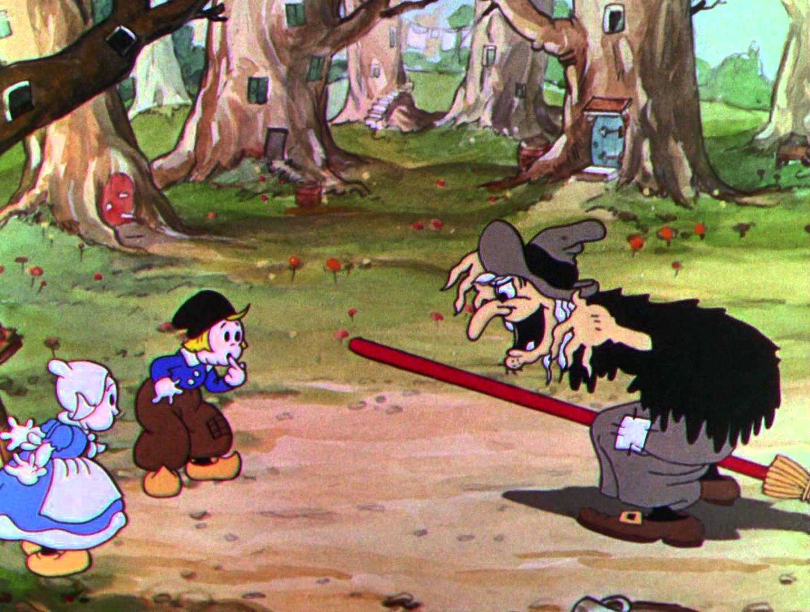
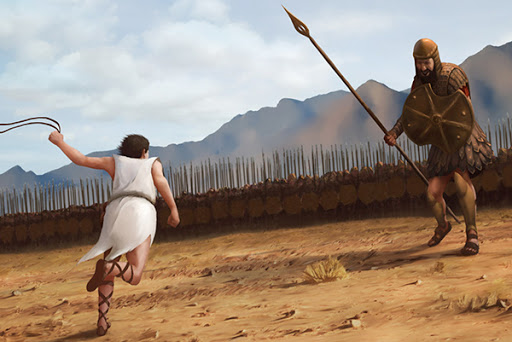

O time de desenvolvimento
=========================

A equipe é formada por membros internos e externos

Interno
********
Na imagem :numref:`fig_equipe_interna` está disposta a equipe interna formada por:

* João
* Maria
* Bruxa

.. _fig_equipe_interna:

    Equipe interna do projeto

Externa
********
Na imagem :numref:`fig_equipe_externa` está disposta a equipe externa formada por:

* Davi
* Golias

.. _fig_equipe_externa:

    Equipe externa do projeto

.. warning::
    Isto é um warning. Se quiser apontar para outros documentos vocÊ pode fazer assim :doc:`design`.

.. note::
    Já aqui temos uma nota.

.. tip::
    Já aqui temos uma dica.
